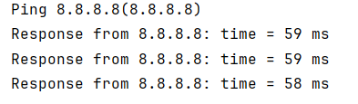

# ✉️ Windows Ping Tool
Простая и и эффективная утилита для проверки сетевого соединения
и получения MAC-адресов устройств в сети, под Windows.

## ⭐️ Особенности
 - Современный C++20 с CMake
 - Нативная поддержка Windows API
 - ICMP ping с изменением времени отклика
 - Получение MAC-адреса целевого устройства через ARP
 - Автоматическое разрешение доменных имён в IP-адреса

## 🚀 Быстрый старт
### Требования
 - Windows 10/11
 - CMake 3.31+
 - Компилятор с поддержкой C++20

### Сборка
```
git clone https://github.com/aLWMoRo/NDM_test__windows.git
cd NDM_test__windows
```
```
mkdir build && cd build
cmake ..
cmake --build . --config Release
```


## 📋 Использование
  ### Ping по Ip-адресу
    NDM_test__windows 8.8.8.8

  ### Ping по доменному имени
    NDM_test__windows google.com

  ### Ping локального устройства
    NDM_test__windows localhost

  ### Пример вывода
  


## 🛠 Технические детали
 - Язык: C++20
 - Система сборки: CMake
 - Зависимости: Windows API (winsock2, ws2tcpip, iphlpapi, icmpapi)
 - Архитектура: Объектно-ориентированная с RAII


## 🗂 Структура проекта
NDM_test__windows/
  — CMakeLists.txt        - Конфигурация CMake
  — main.h                - Header файл
  — main.cpp              - Основная логика приложения
  — README                - Документация


## 🔧 Особенности реализации
 - Используется Windows API для отправки ping-пакетов
 - Автоматическое управление ресурсами через конструктр и деструктор
 - Поддержка как IPv4-адресов, так и доменных имён
 - Получение MAC-адресов через SendARP API


## 📝 Лицензия
Проект создан исключительно в образовательных целях.
